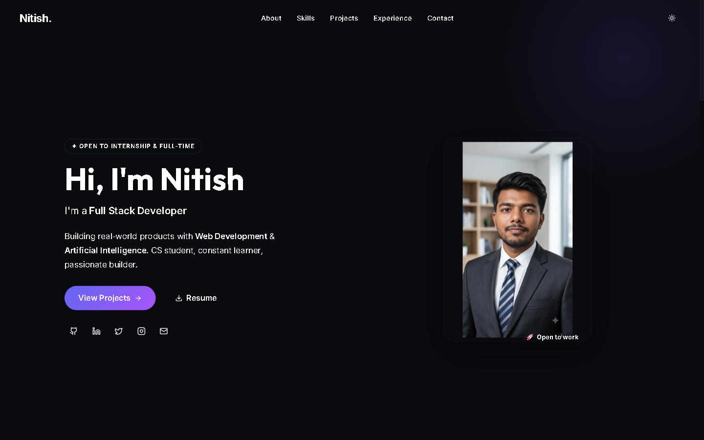
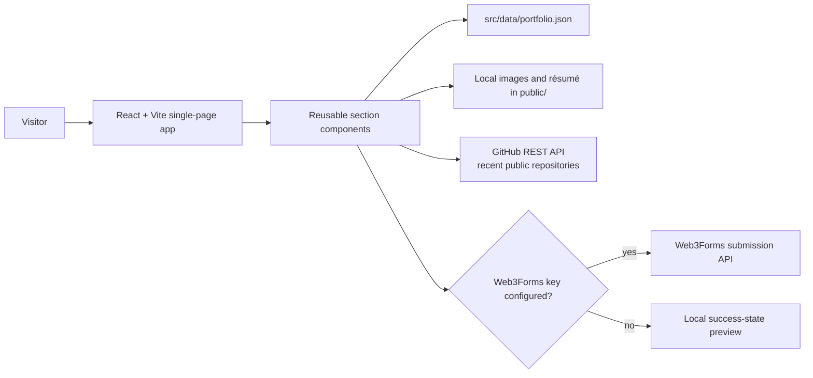

# Nitish Singh — Portfolio

[](https://cod4nitish.github.io/portfolio/)

An interactive personal portfolio for **Nitish Singh**, built to present selected AI, full-stack, and frontend work. It combines a responsive React interface, motion, project data, a résumé download, and recent public GitHub activity in one static site.

**Live site:** [cod4nitish.github.io/portfolio](https://cod4nitish.github.io/portfolio/)



## Highlights

- Responsive sections for the introduction, skills, experience, projects, résumé, and contact.
- Framer Motion entrance and navigation animations, with a light/dark theme toggle.
- Featured project cards for ForgeMind, MRStay AI, PhishGuard AI, and this site, each using a real screenshot from `public/projects/`.
- Portfolio content managed in one place: [`src/data/portfolio.json`](src/data/portfolio.json).
- Recent public-repository activity fetched directly from the GitHub REST API at runtime.
- GitHub Pages deployment through `gh-pages`.

## Architecture



The application is a static client-side site: there is no custom server or database. Project and contact data are read from the local JSON file, while the GitHub activity panel fetches public information in the browser.

## Tech stack

| Area | Technology |
| --- | --- |
| UI | React 19, Vite |
| Motion | Framer Motion |
| Styling | Custom CSS |
| Icons | Lucide React, React Icons |
| Deployment | GitHub Pages, `gh-pages` |

## Project structure

```text
src/
  components/       # Portfolio sections and reusable UI
  data/             # Editable portfolio and contact content
  styles/           # Global styles and section styles
  assets/           # Visual assets used by the React app
public/
  Nitish_Singh_Resume.pdf
  profile*.{jpg,png}
  projects/         # Project-card screenshots referenced from portfolio.json
docs/screenshots/   # README images
```

## Run locally

Prerequisite: Node.js 20 or newer.

```bash
git clone https://github.com/Cod4Nitish/portfolio.git
cd portfolio
npm ci
npm run dev
```

The development server prints the local URL. Use the following checks before publishing:

```bash
npm run lint
npm run build
npm run preview
```

## Customize the portfolio

Update [`src/data/portfolio.json`](src/data/portfolio.json) to change the introduction, social links, skills, experience, project cards, and contact settings. Replace the résumé and portrait assets under `public/` and `src/assets/` when those change.

Project-card `image` values are paths relative to the site root (for example `projects/forgemind.png`), so they resolve correctly under the `/portfolio/` base path set in `vite.config.js`. Keep each card's description to what the linked repository actually does.

## Accessibility and performance notes

- Project images use `loading="lazy"` and `alt` text; the project-card links and theme toggle carry `aria-label`s.
- The site is fully static, so GitHub Pages serves it without a server runtime.
- The GitHub activity panel calls the unauthenticated GitHub REST API from the visitor's browser, which is rate-limited to 60 requests per hour per IP. If the limit is hit, the panel shows an error state instead of repositories.

### Contact form behaviour

Set `contact.web3formsKey` in `src/data/portfolio.json` only when a real [Web3Forms](https://web3forms.com/) access key is available. If the value is blank, the interface intentionally shows a local success-state preview and does **not** send a message. This makes it easy to demo the page without implying that a contact form is live.

## Deploy

The repository is configured to publish the production build to GitHub Pages:

```bash
npm run deploy
```

This runs the production build and publishes `dist/` to the `gh-pages` branch. Confirm that GitHub Pages is configured to serve that branch before sharing the site.

## Related work

- [ForgeMind](https://github.com/Cod4Nitish/ForgeMind) — agentic engineering command center.
- [MRStay AI](https://github.com/Cod4Nitish/MRStay_AI) — agentic real-estate sales platform.
- [PhishGuard-AI](https://github.com/Cod4Nitish/PhishGuard-AI) — phishing-awareness and security UX prototype.

## License

Released under the [MIT License](LICENSE).
